### 面向对象原则

#### 单一职责原则

- 就一个类而言，应该仅有一个引起它变化的原因。若一个类承担的职责过多，就等于把这些职责耦合在一起，一个职责的变化可能会削弱或抑制这个类完成其他职责的能力，该耦合会导致脆弱的设计
- 若能想到多于一个的动机去改变一个类，那么这个类就具有多于一个的职责

#### 开放-封闭原则

- 软件实体（类、模块、函数等）可以扩展，但不可以修改
- 无论模块是多么封闭，都会存在一些无法封闭的变化，设计人员必须对他设计的模块应该对哪中变化封闭做出选择，构造出抽象隔离这些变化。在开始编写时假设变化不会发生，当变化发生时就创建抽象来隔离以后发生的同类变化，且最好在开发前期就发现可能发现的变化。
- 开发人员应该仅对程序中呈现出频繁变化的部分做出抽象，而不是对每个部分都刻意进行抽象

#### 依赖倒转原则

- 抽象不应该依赖细节，细节应该依赖于抽象。即针对接口编程，不要针对实现编程，高层需要不需要去考虑底层的细节，底层模块也不需要考虑高层细节，两者只需要考虑之间的接口就行
- 依赖倒转原则可以是面向对象设计的标志，用哪种语言来编写程序不重要，若编写时考虑的都是如何针对抽象编程而不是针对细节编程，即程序中所有依赖关系都是终止于抽象类或者接口，则是面向对象的实际，否则就是过程化设计

##### 里氏代换原则

- 一个软件实体若使用的是一个父类的话，则一定适用于其子类，而且察觉不出父类对象和子类对象的区别。即父类换成子类程序行为不变
- 只有当子类可以替换掉父类，软件单位的功能不受到影响时，父类才能真正被复用，而子类也能在父类的基础上增加新的行为
- 由于子类型的可替换性才使得父类类型的模块在无需修改的情况下就可以扩展

#### 迪米特法则

- 若两个类不必彼此直接通信，则两个类就不应当发生直接的相互作用，若其中一个类需要调用另一个类中的某个方法，可以通过第三者转发调用
- 其强调了每一个类都应当尽量减少成员的访问权限，即类之间的松耦合，耦合越弱越利于复用

#### 合成/聚合复用原则

- 尽量使用合成/聚合，尽量不使用类继承
- 聚合表示一种弱的拥有关系，体现A对象可以包含B对象但B对象不是A对象的一部分，合成则是一种强的拥有关系，体现了严格的整体和部分的关系，两者生命周期一样
- 优点：优先使用对象的合成/聚合有助于保持每个类被封装，并被击中在单个任务上，这样类和类继承层次会保持较小的规模，并且不太可能增长为不可控制的庞然大物

#### 接口分离原则

- 不能强迫用户去依赖他们不使用的接口，即接口应尽量小，且若接口b依赖于接口a，则使用b接口的肯定会用到a接口

### 简单工厂模式

- 在使用简单工厂的地方都可以考虑用反射技术去除switch等分支判断带来的耦合

**代码**

```c++
// Operation
class Operation {
public:
	virtual double GetResult(double left, double right) = 0;
};

class Addition : public Operation {
public:

	virtual double GetResult(double left, double right) override
	{
		return left + right;
	}
};

class Subtract : public Operation {
public:

	virtual double GetResult(double left, double right) override
	{
		return left - right;
	}

};

class Multiple : public Operation {
public:

	virtual double GetResult(double left, double right) override
	{
		return left * right;
	}

};
class Division : public Operation {
public:

	virtual double GetResult(double left, double right) override
	{
		if (right == 0) {
			cerr << "Division error: devidend is null";
			return 0;
		}
		return left / right;
	}

};
```

```c++
class Factory {
public:
	Operation* Create(char operate) {
		switch (operate)
		{
		case '+':
			return new Addition();
			break;
		case '-':
			return new Subtract();
			break;
		case '*':
			return new Multiple();
			break;
		case '/':
			return new Division();
			break;
		}
	}
};
```

**设计**

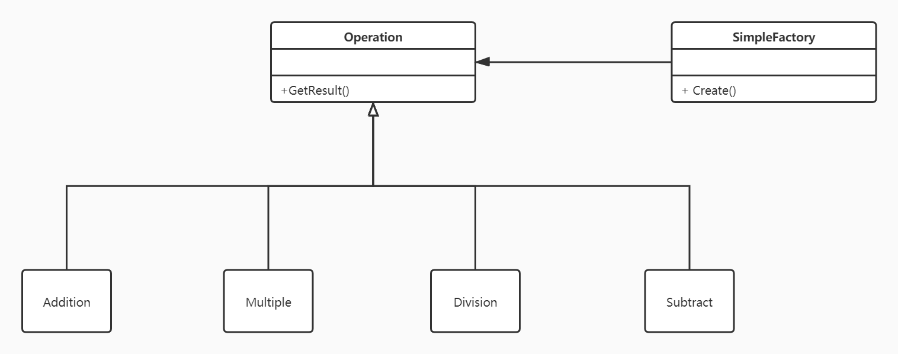

### 创建型模式

- 创建型模式隐藏了类的实例是如何被创建和放在一起，整个系统关于这些对象所知道是由抽象类所定义的接口，这样对于创建了什么、谁创建、怎么被创建以及何时创建这些方面提供了很高的灵活性

#### 工厂方法模式

- 定义一个用于创建对象的接口，让子类决定实例化哪一个类，使一个类的实例化延迟到其子类
- 简单工厂模式方法的优势在于工厂类中包含了必要的逻辑判断，根据客户端的选择动态实例化相关类，降低了耦合性。但在增加一个新功能时，工厂类对修改也开放了
- 工厂方法模式把简单工厂的内部逻辑判断转移到了客户端代码来进行，但让其符合了开放-封闭原则。若要解决客户端判断问题，可以利用反射机制

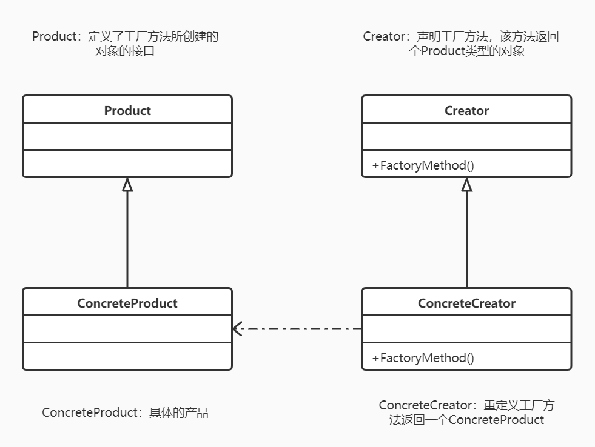

#### 抽象工厂模式

- 提供一个创建一系列相关或相互依赖对象的接口，而无需指定它们具体的类

- 优点：

  - 易于产品的交换，由于具体工厂类在一个应用中只需要在初始化时出现一次，使得改变一个应用的具体工厂变得非常容易，只需要改变具体工厂即可使用不同的产品配置
  - 让具体的创建实例过程与客户端分离，客户端通过它们的抽象接口操作实例，产品的具体类名也被具体工厂的实现分离，不会出现在客户端代码中

  缺点：

  - 每次改动或增加功能时需要进行更改的类很多

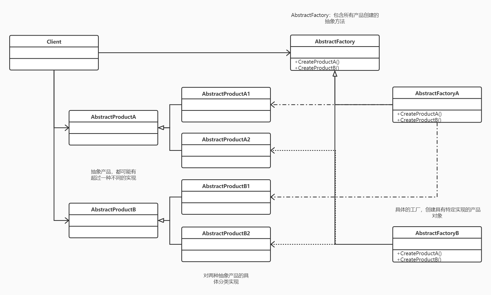

#### 建造者模式

- 将一个复杂对象的构件和它的表示分离，使得同样的构建过程可以创建不同的表示
- 优点：使得建造代码和表示代码分离，隐藏了产品是如何组装的，若需要改变一个产品的内部表示，只需要再定义一个具体的建造者即可
- 使用场景：
  - 当创建复杂对象的算法应该独立于该对象的组成部分以及它们的装配方式时适用的模式

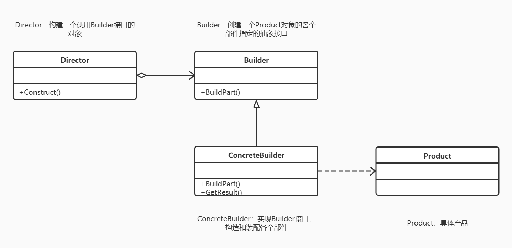

**代码**

```c++
class Product {
public:

	void Add(string part) {
		parts.push_back(part);
	}

	void Show() {
		for (auto part : parts) {
			cout << part;
		}
	}

private:
	vector<string> parts;
};

class Builder {
public:
	virtual void BuildPartA() = 0;
	virtual void BuildPartB() = 0;
	virtual Product GetResult() = 0;
};

class ConcreteBuilderA : public Builder {
public:
	virtual void BuildPartA() override {
		product.Add("部件A");
	}

	virtual void BuildPartB() override {
		product.Add("部件B");
	}
	virtual Product GetResult()override {
		return product;
	}
private:
	Product product;
};

class ConcreteBuilderB : public Builder {
public:
	virtual void BuildPartA() override {
		product.Add("部件X");
	}

	virtual void BuildPartB() override {
		product.Add("部件Y");
	}
	virtual Product GetResult()override {
		return product;
	}
private:
	Product product;
};

class Director {
public:
	void Construct(Builder builder) {
		builder.BuildPartA();
		builder.BuildPartB();
	}
};
```

#### 原型模式

- 用原型实例指定创建对象的种类，并且通过拷贝这些原型创建新的对象。就是从一个对象再创建另一个可定制对象且不需要知道任何创建细节
- 使用情景：在初始化信息不发生变化的情况下，既隐藏了对象创建的细节，又对性能大大提高。不用重新初始化对象，而动态获得对象运行时的状态
- C#中的Clone方法就是浅拷贝，Copy为深拷贝


**代码**

```c++
class Prototype {
public:
	Prototype(string id) {
		this->id = id;
	}

	string getId() {
		return id;
	}

	virtual Prototype* Clone() = 0;
private:
	string id;
};

class ConcretePrototypeA : public Prototype {
public:
	ConcretePrototypeA(string id)
		: Prototype(id)
	{
		
	}

	virtual Prototype* Clone() override {
		// 将值进行深拷贝，引用进行浅拷贝，然后返回对象
  		// 若该实例化需要更改基类的某个引用属性，则引用进行深拷贝
		return this;
	}
};
```

#### 单例模式

- 保证一个类仅有一个实例，并提供一个访问它的全局访问点
- 饿汉式是在自己被加载时就进行实例化，懒汉式在第一次被引用时实例化
- 在考虑多线程时，懒汉式需要先判断是否为空再决定加锁，因为加锁是一个非常耗费性能的，加锁后再判断是否为空避免重复赋值
- C#的公共语言运行库也提供了一种静态初始化方法，不需要开发人员显示的编写线程安全代码即可解决多线程环境下不安全的问题。首先对基类使用sealed关键字防止派生，然后使用readonly使一个单例为只读且在声明时直接定义让第一次引用类时公共语言运行库负责处理变量初始化

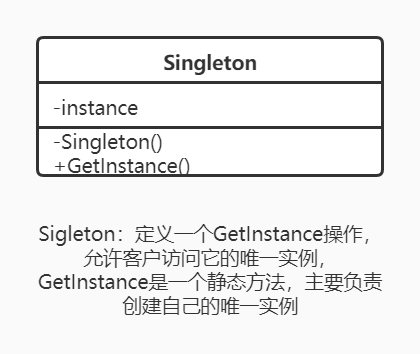

**代码**

```c++
class Singleton {
public:
	static Singleton* GetInstance() {
		if (instance == nullptr) {
			instance = new Singleton();
		}
		return instance;
	}
private:
	Singleton() = default;
private:
	static Singleton* instance;
};
```

### 结构型模式

#### 适配器模式

- 将一个类的接口转换成客户希望的另一个接口，使得原本由于接口不兼容而不能一起工作的那些类可以一起工作
- 使用场景：当系统的数据和行为都正确，但接口不符时，应该考虑用适配器，使控制范围之外的一个原有对象与某个接口匹配。适配器模式主要应用于希望复用一些现存的类，但接口又与复用环境要求不一致的情况
- GOF分类适配器和对象适配器，类适配器模式通过多重继承对一个接口和另一个接口进行匹配（这里讲的是对象适配器）
- C#中使用DataAdapter用作DataSet和数据源之间的适配器，以便检索和保存数据，DataAdapter通过映射Fill和Update来提供这一适配器


**代码**

```c++
class Target {
public:
	virtual void Request() {
		
	}
};

class Adaptee {
public:
	virtual void SpecificRequest() {

	}
};

class Adapter : public Target {
public:
	virtual void Request() override {
		// 将表面的Request变为实际得SpecificRequest
		adaptee.SpecificRequest();
	}
private:
	Adaptee adaptee;
};
```

#### 桥接模式

- 将抽象部分与它的实现部分分离，使它们都可以独立的变化。通俗指实现系统可能有多角度分类，每一种分类都有可能变化，则把这种多角度分离出来让其独立变化，减少直接的耦合

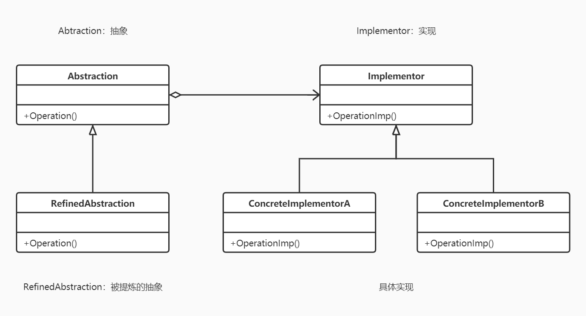

**代码**

```c++
class Implementor {
public:
	virtual void Operation() = 0;
};

class ConcreteImplementorA : Implementor {
public:
	virtual void Operation() override {
		
	}
};

class ConcreteImplementorB : Implementor {
public:
	virtual void Operation() override {

	}
};

class Abstraction {
public:
	void SetImplementor(Implementor* implementor) {
		this->implementor = implementor;
	}

	virtual void Operation() {
		implementor->Operation();
	}
protected:
	Implementor* implementor;
};

class RefinedAbstraction : Abstraction {
public:
	virtual void Operation() override {
		implementor->Operation();
	}
};
```

#### 组合模式

- 将对象组合成树形结构以表示部分-整体的层次结构，使得用户对单个对象和组合对象的使用具有一致性

- 透明方式：在Component中声明所有用来管理子对象的方法，其中包括Add、Remove等，这样实现Component接口中所有子类都具备了Add和Remove，这样做的好处就是叶节点对于外界没有区别，具备完全一致的行为接口，问题是叶子节点本身不具备Add和Remove，所以实现是没有意义的

  安全方式：在Component中不去声明Add和Remove方法，子类Leaf也不许要实现它，而在Composite中声明所有用来管理子类对象的方法，坏处是客户端的调用需要做相应的判断带来了不便

- 使用场景：需求中是体现部分与整体层次的结构时，希望用户可以忽略组合对象和单个对象的不同，统一的使用组合结构中的所有对象时，就可以考虑用组合模式

- 优点：组合模式定义了包含基本对象和组合对象的层次结构，基本对象可以被组合成更复杂的组合对象，而这个组合对象又可以被组合，不断的递归下去，客户代码中任何用到基本对象的地方都可以使用组合对象了。用户不用关心到底是如何处理一个叶节点还是处理一个组合组件，也就用不着为定义组合而写一些选择判断语句了，可以一致的使用组合结构和单个对象

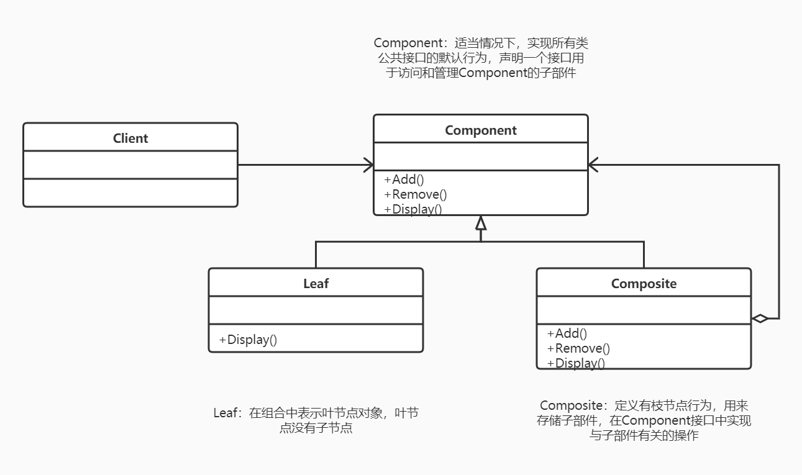

**代码**

```c++
class Component {
public:
	Component(string n) {
		name = n;
	}

	virtual void Add(Component c) = 0;
	virtual void Remove(Component c) = 0;
	virtual void Display(int depth) = 0;
protected:
	string name;
};

class Leaf : public Component {
public:
	Leaf(string name)
		: Component(name)
	{
	}
	
	virtual void Add(Component c) override {

	}

	virtual void Remove(Component c) override {

	}

	virtual void Display(int depth) {

	}
};

class Composite : public Component {
public:
	Composite(string n)
		: Component(n)
	{

	}

	virtual void Add(Component c) override {
		children.push_back(c);
	}
	 
	virtual void Remove(Component c) override {
		children.erase(c);
	}

	virtual void Display(int depth) {
		for (Component c : children) {
			c.Display(depth + 2);
		}
	}
private:
	vector<Component> children;
};
```

#### 装饰者模式

- 动态的给一个对象添加一些额外的职责，就增加功能来说，装饰模式比生成子类更灵活
- 装饰者模式是为已有功能动态添加更多功能的一种方式，当系统需要新功能的时候，向旧的类中添加新的代码，其装饰了原有类的核心职责或主要行为，这些新增加的一些东西仅仅是为了满足一些只在某特定情况下才会执行的特殊行为的需要
- 优点：将核心职责和装饰功能分开，即把类中的装饰功能从类中移除以避免重复的装饰逻辑，简化原有类


**代码**

```c++
class Component {
public :
	virtual void Operation() = 0;
};
// 具体被装扮的对象
class ConcreteComponent : public Component {
public:
	virtual void Operation() override {
	
	}
};

class Decorator : public Component {
public:
	void SetComponent(Component* component) {
		this->component = component;
	}

	virtual void Operation() override {
		if (component != nullptr) {
			component->Operation();
		}
	}
protected:
	Component* component;
};

class ConcreteDecoratorA : public Decorator {
public:
	virtual void Operation() override {
		// 该操作前或后加上其他动作，即装饰
		Decorator::Operation();
	}
};

class ConcreteDecoratorB : public Decorator {
public:
	virtual void Operation() override {
		// 该操作前或后加上其他动作，即装饰
		Decorator::Operation();
	}
};
```

#### 外观模式

- 为子系统中的一组接口提供一个一致的界面，其定义了一个高层接口使子系统更加容易使用
- 使用情形：
  - 在设计初期阶段，有意识将不同的两个层分离，层与层之间建立外观Facade。在开发阶段子系统往往因为不断重构演化变的越来越复杂，增加Facade可以提供一个简单的接口减少依赖。在维护一个遗留的大型系统时，若难以维护或扩展，可以为新系统的开发一个Facade，提供设计粗糙或高度复杂的遗留代码的比较清晰的接口，让新系统与Facade对象交互，Facade与遗留代码交互


**代码**

```c++
class SubSystemA {
public:
	void Method() {

	}
};

class SubSystemB {
public:
	void Method() {

	}
};

class SubSystemC {
public:
	void Method() {

	}
};

class SubSystemD {
public:
	void Method() {

	}
};

class Facade {
public:
	Facade() {
		// 初始化私有变量
	}

	void MethodA() {
		// 通过不同的变量所包含的Method进行组合
	}

	void MethodB() {
		// 通过不同的变量所包含的Method进行组合
	}

private:
	SubSystemA a;
	SubSystemB b;
	SubSystemC c;
	SubSystemD d;
};
```

#### 享元模式

- 运用共享技术有效的支持大量细粒度的对象
- 享元模式可以避免大量非常相似类的开销，有时需要生成大量细粒度的类实例来表示数据，若这些实例除了几个参数外基本相同，有时就能够大量减少需要实例化的类的数量。若能把那些参数转移到类实例外面，在方法调用时将它们传递进来就可以通过共享大幅度减少单个实例的数目
- 使用情形：
  - 若一个应用程序使用了大量的对象，而且造成了很大的存储开销时考虑使用
  - 对象的大多数状态为外部状态，若删除对象的外部状态，可以用相对较少的共享对象取代很多组对象，可以考虑使用

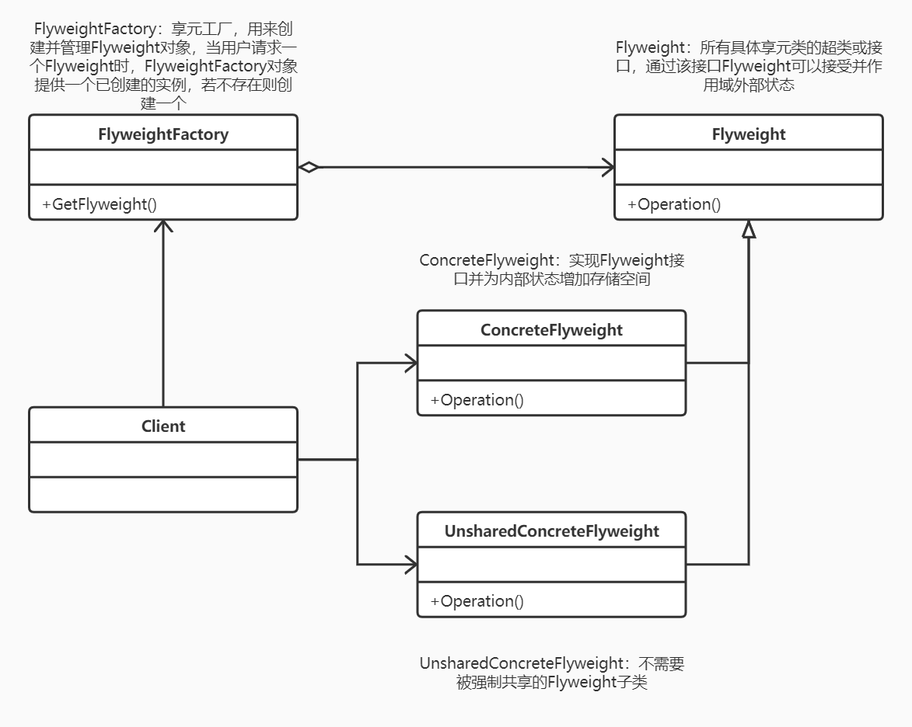

**代码**

```c++
class Flyweight {
public:
	virtual void Operation(int extrinsicState) = 0;
};

class ConcreteFlyweight : public Flyweight {
public:
	virtual void Operation(int extrinsicState) override {

	}
};

class UnsharedConcreteFlyweight : public Flyweight {
public:
	virtual void Operation(int extrinsicState) override {

	}
};

class FlyweightFactory {
public:
	FlyweightFactory() {
		// 初始化
	}

	Flyweight* getFlyweight(string key) {
		return flyweights[key];
	}

private:
	unordered_map<string, Flyweight*> flyweights;
};
```

#### 代理模式

- 为其他对象提供一种代理以控制这个对象的访问
- 使用场合，为被代理对象附加特殊用途：
  - 远程代理，为一个对象在不同的地址空间提供局部代表，可以隐藏一个对象存在于不同地址空间的事实
  - 虚拟代理，根据需要创建开销很大的对象，通过它来存放实例化需要很长时间的真实对象
  - 安全代理，控制真实对象访问时权限
  - 智能代理，当调用真实的对象时，代理处理另一些事件


**代码**

```c++
class Subject {
public:
	virtual void Request() = 0;
};

class RealSubject : public Subject {
public:
	virtual void Request() override {
		
	}
};

class Proxy : public Subject {
public:
	virtual void  Request() {
		if (realSubject == nullptr) {
			realSubject->Request();
		}
	}
private:
	RealSubject* realSubject;
};
```

### 行为型模式

#### 命令模式

- 将请求封装为一个对象，从而使你可用不同的请求对客户进行参数化，对请求排队或记录请求日志，以及支持可撤销的操作
- 优点：
  - 较容易设计一个命令队列
  - 在需要的情况下可以教容易的将命令记入日志
  - 允许接受请求的一方决定是否要否决请求
  - 可以容易的实现对请求的撤销和重做
  - 加入新的具体命令类不影响其他的类，所以加入命令很容易
  - 命令模式把请求一个操作的对象与知道怎么执行一个操作的对象分割开


**代码**

```c++
class Receiver {
public:
	void Action() {

	}
};

class Command {
public:
	Command(Receiver receiver) {
		this->receiver = receiver;
	}

	virtual void Execute() = 0;
protected:
	Receiver receiver;
};

class ConcreteCommand : public Command {
public:
	ConcreteCommand(Receiver receiver)
		:Command(receiver)
	{

	}

	virtual void Execute() override {
		receiver.Action();
	}
};

class Invoker {
public:
	void setCommand(Command* c) {
		command = c;
	}

	void ExecuteCommand() {
		command->Execute();
	}
private:
	Command* command;
};
```

#### 职责链模式

- 使多个对象都有机会处理请求，从而避免请求的发送者和接收者之间的耦合关系，将该对象连成一条链，并沿着该链传递请求，直到有一个对象处理它为止
- 优点：
  - 当用户提交一个请求时，请求是沿着链传递直至有一个ConcreteHandler对象负责处理，使得接收者和发送这都没有对方的明确信息，且链中的对象也不知道链的结果，可以简化对象的相互连接，仅需保持一个指向其后继者的引用，而不需要保持它所有的候选者接受者的引用

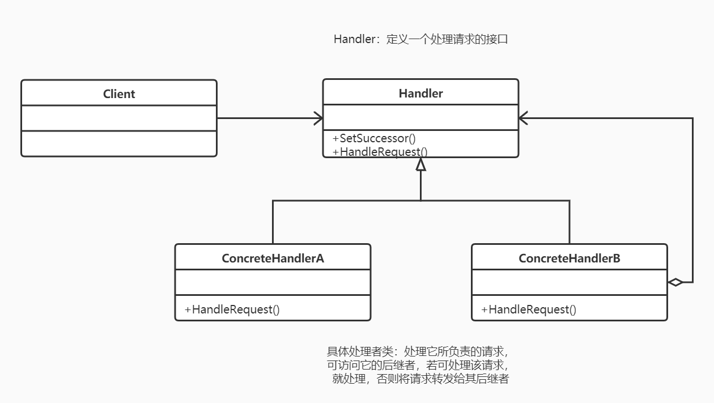

**代码**

```c++
class Handler {
public:
	virtual void HandleRequest(int request) = 0;

	void serSuccessor(Handler* successor) {
		this->successor = successor;
	}
protected:
	Handler* successor;
};

class ConcreteHandlerA : Handler {
public:
	virtual void HandleRequest(int request) override {
		if (request >= 0 && request < 10) {
			// 处理请求
		}
		else if (successor != nullptr) {
			successor->HandleRequest(request);
		}
	}
};

class ConcreteHandlerB: Handler {
public:
	virtual void HandleRequest(int request) override {
		if (request >= 10 && request < 20) {
			// 处理请求
		}
		else if (successor != nullptr) {
			successor->HandleRequest(request);
		}
	}
};
```

#### 模板方法模式

- 定义一个操作中算法的骨架，而将一些步骤延迟到子类中，使得子类可以不改变一个算法的结构即可重定义该算法的某些特定步骤
- 模板方法模式把不变行为搬移到父类，去除子类中重复代码，提供了一个很好的代码复用平台。当不变和可变的行为在方法的子类实现中混合在一起的时候，不变的行为就会在子类中重复出现


#### 观察者模式

- 定义了一种一对多的依赖关系，让多个观察者对象同时监听某一个对象，该对象在状态发生变化时会通知所有观察者对象，使其能自动更新自己
- 使用观察者模式的动机：将一个系统分割成一系列相互合作的类有一个不好的副作用，也就是需要维护相关对象间的一致性，不希望为了维持一致性而使各类紧密耦合，给维护、扩展和重用都带来不便
- 使用情形：
  - 当一个对象的改变需要改变其他对象，且不知道有多少对象有待改变
- 观察者模式是在解耦，让耦合的双方都依赖于抽象，而不依赖于具体
- 不足：若观察者所需调用的方法不同，或者根本没有抽象观察者这样的接口，就无法通知观察者
- 委托就是一种引用方法的类型，一旦为委托分配了方法，就会拥有与其相同的行为，可以看做是函数的抽象，委托的实例将代表一个具体的函数。一个委托可以搭载多个方法，所有方法被依次唤起，可以使委托对象所搭载的方法并不需要属于同一个类。但委托对象所搭载的方法必须具有相同的参数列表和返回值类型
- 委托和观察者模式各有优缺点

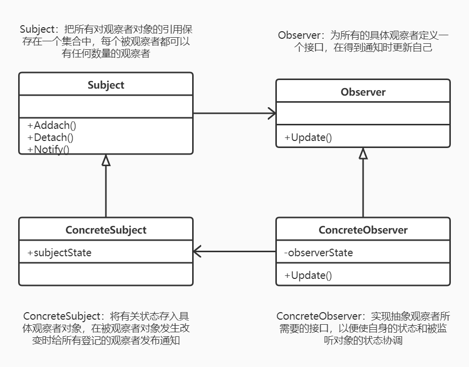

**代码**

```c++
class Observer {
public:
	virtual void Update() = 0;
};

class Subject {
public:
	void Attach(Observer observer) {
		observers.push_back(observer);
	}

	void Detach(Observer observer) {
		observers.erase(observer);
	}

	void Notify() {
		for (Observer o : observers) {
			o.Update();
		}
	}
private:
	vector<Observer> observers;
};

class ConcreteSubject : public Subject {
public:
	string getSubjectState() {
		return subjectState;
	}
private:
	string subjectState;
};

class ConcreteObserver : public Observer {
public:
	ConcreteObserver(ConcreteSubject subject, string name) {
		this->subject = subject;
		this->name = name;
	}

	virtual void Update() override {
		observerState = subject.getSubjectState();
	}

	ConcreteSubject getSubject() {
		return subject;
	}
private:
	string name;
	string observerState;
	ConcreteSubject subject;
};
```

#### 状态模式

- 当一个对象的内在状态改变时允许改变其行为，这个对象看起来像是改变了其类
- 主要解决的是当控制一个对象状态转换的条件表达式过于复杂的情况，把状态的判断逻辑转移到表示不同状态的一系列类中，可以把复杂的判断逻辑简化
- 优点：
  - 将特定的状态相关的行为都存放入一个对象中，由于所有与状态相关的代码都存在于某个ConcreteState，所以通过定义新的子类可以很容易的增加新的状态和转换，通过把各种状态转移逻辑分布到State的子类之间来减少相互间的依赖
- 使用场景：当一个对象的行为取决于它的状态，且必须在运行时根据状态改变它的行为时，就可以考虑使用状态模式

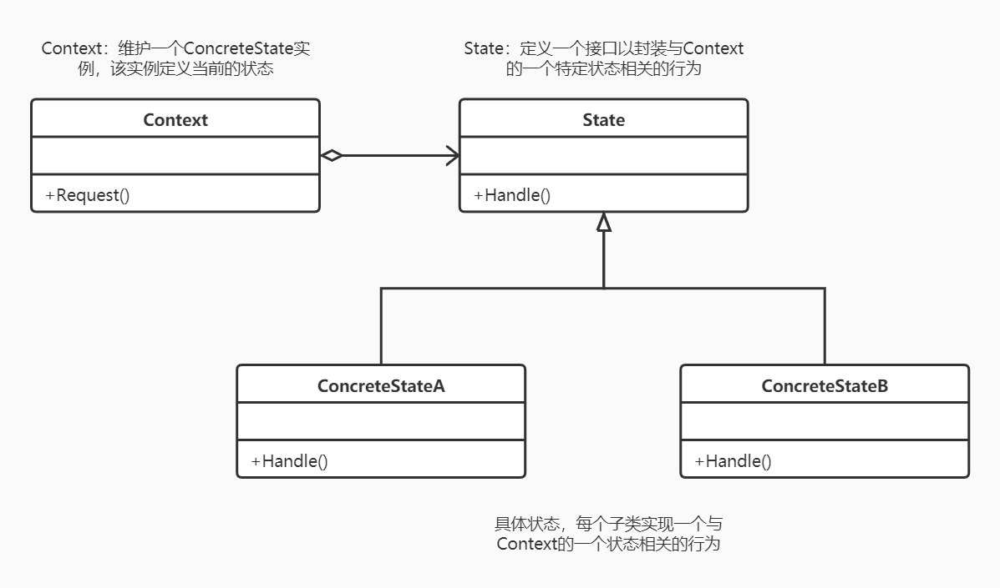

**代码**

```c++
class Context {
public:
	Context(State* state) {
		this->state = state;
	}

	void setState(State* state) {
		this->state = state;
	}

	State* getState() {
		return state;
	}

	void Request() {
		state->Handle(this);
	}
private:
	State* state;
};

class State {
public:
	virtual void Handle(Context* context) = 0;
};

class ConcreteStateA : public State {
public:
	virtual void Handle(Context* context) override {
		context->setState(new ConcreteStateB());
	}
};

class ConcreteStateB : public State {
public:
	virtual void Handle(Context* context) override {
		context->setState(new ConcreteStateA());
	}
};
```

#### 策略模式

- 策略模式：定义一系列算法的方法，这些算法完成相同的工作，只是实现不同，可以使用相同的方式调用所有方法，减少了各种算法类与使用算法类之间的耦合
- 策略模式可以封装几乎任何类型的规则，当一个需求需要在不同时间应用不同的业务规则，就可以考虑使用策略模式处理的可能性
- 优点：
  - 策略模式的Strategy类层次为Context定义了一系列的可共重用的算法或行为，继承有助于取出算法中的公共功能
  - 简化了单元测试，每个算法都有自己的算法类，可以通过自己的接口单独测试


**代码**

```c++
// Strategy
class CashSuper {
public:
	virtual double acceptCash(double money) = 0;
};

class CashNormal : public CashSuper {
public:
	virtual double acceptCash(double money) override {
		return money;
	}
};

class CashRebate : public CashSuper {
public:
	CashRebate(double rebate = 1.0) {
		moneyRebate = rebate;
	}

	virtual double acceptCash(double money) override {
		return money * moneyRebate;
	}
private:
	double moneyRebate;
};

class CashReturn : public CashSuper {
public:
	CashReturn(double condition = 0, double ret = 0) {
		moneyCondition = condition;
		moneyReturn = ret;
	}

	virtual double acceptCash(double money) override {
		if (money > moneyCondition) {
			money -= (int)(money / moneyCondition) * moneyReturn;
		}
		return money;
	}
	
private:
	double moneyCondition;
	double moneyReturn;
};
```

```c++
// Context。缺点：还是需要在客户端去判断使用哪种策略
class CashContext {
public:
	CashContext(CashSuper* cSuper) {
		cs = cSuper;
	}

	double GetResult(double money) {
		return cs->acceptCash(money);
	}
private:
	CashSuper* cs;
};
```

```c++
// Context。在策略类中结合工厂方法
enum class CashType {
	Normal,
	Rebate,
	Return
};

class CashContext {
public:
	CashContext(CashType type) {
		switch (type) {
		case CashType::Normal:
			cs = new CashNormal();
			break;
		case CashType::Rebate:
			cs = new CashRebate();
			break;
		case CashType::Return:
			cs = new CashReturn();
			break;
		default:
			cs = nullptr;
			break;
		}
	}

	double GetResult(double money) {
		return cs->acceptCash(money);
	}
private:
	CashSuper* cs;
};
```


#### 备忘录模式

- 在不破坏封装性的前提下，捕获一个对象的内部状态，并在该对象外保存该状态，以后就可以将对象恢复到原先保存的状态
- 将要保存的细节封装给Memento，当更改细节也不会影响客户端
- 使用场景：
  - 功能比较复杂，但需要维护或记录属性历史的类
  - 需要保存的属性只是众多属性中的一小部分


**代码**

```c++
class Memento {
public:
	Memento(string state) {
		this->state = state;
	}

	string getState() {
		return state;
	}
private:
	string state;
};

class Originator {
public:

	Memento CreateMemento() {
		return Memento(state);
	}

	void SetMemento(Memento memento) {
		state = memento.getState();
	}

	void Show() {

	}
	
private:
	string state;
};

class Caretaker {
public:
	Memento getMemento() {
		return memento;
	}

	void setMemento(Memento memento) {
		this->memento = memento;
	}

private:
	Memento memento;
};
```

#### 迭代器模式

- 提供一种方法顺序访问一个聚合对象中各个元素，而又不暴露该对象的内部表示

- 使用情形：当需要访问一个聚集对象，而不管这些对象是什么都需要遍历的时候，考虑用迭代器模式
- C#中IEumerator就是迭代器的接口

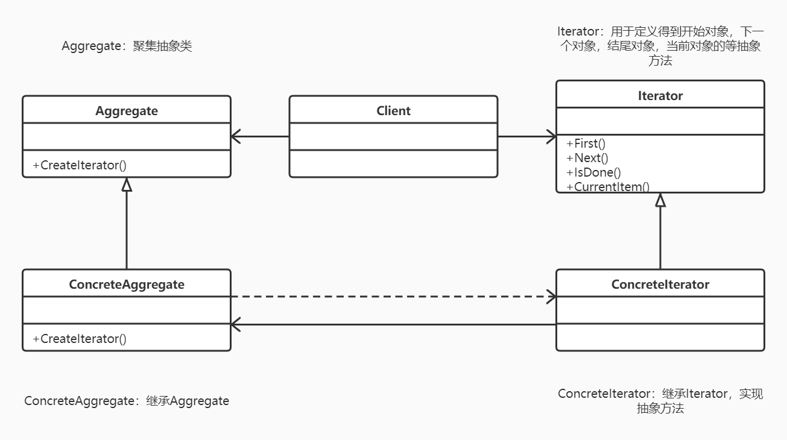

**代码**

```c++
class Iterator {
public:
	virtual int first() = 0;
	virtual int next() = 0;
	virtual bool isDone() = 0;
	virtual int currentItem() = 0;
};

class Aggregate {
public:
	virtual Iterator* CreateIterator() = 0;
};

class ConcreteAggregate : public Aggregate {
public:
	virtual Iterator* CreateIterator() override {
		return new ConcreteIterator(this);
	}

	int Count() {
		return items.size();
	}

	int operator[](int index) {
		if (index < 0 || index >= items.size()) return -1;
		return items[index];
	}

	int Add(int item) {
		items.push_back(item);
	}


private:
	vector<int> items;
};

class ConcreteIterator : public Iterator {
public:
	ConcreteIterator(ConcreteAggregate* aggregate) {
		this->aggregate = aggregate;
	}

	virtual int first() override {
		return (*aggregate)[0];
	}
	virtual int next() override {

	}
	virtual bool isDone() override {

	}
	virtual int currentItem() override {
		return (*aggregate)[current];
	}

private:
	ConcreteAggregate* aggregate;
	int current = 0;
};

```

#### 中介者模式

- 对一个中介对象来封装一系列的对象交互，中介者使各对象不需要显式的互相引用，从而耦合松散，而且可以独立改变它们之间的交互
- 中介者模式很容易在系统中应用，也容易误用，当系统出现多对多交互复杂的对象群时，先考虑是否在设计上出现问题，再考虑中介者模式
- 应用场景：
  - 一般应用于一组对象以定义良好但复杂的方式进行通信的场合
  - 想定制一个分布在多个类中的行为，而又不想生成太多子类的场合

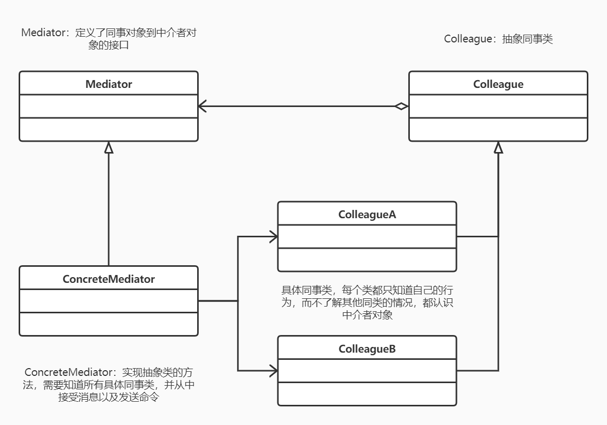

**代码**

```c++
class Colleague {
public:
	Colleague(Mediator* mediator) {
		this->mediator = mediator;
	}
protected:
	Mediator* mediator;
};

class ConcreteColleagueA : public Colleague {
public:
	ConcreteColleagueA(Mediator* mediator)
		: Colleague(mediator)
	{

	}

	void Send(string message) {
		mediator->Send(message, this);
	}

	void Notify(string message) {

	}
};

class ConcreteColleagueB : public Colleague {
public:
	ConcreteColleagueB(Mediator* mediator)
		: Colleague(mediator)
	{

	}

	void Send(string message) {
		mediator->Send(message, this);
	}

	void Notify(string message) {

	}
};

class Mediator {
public:
	virtual void Send(string message, Colleague* colleague) = 0;
};

class ConcreteMediator : public Mediator {
public:
	virtual void Send(string message, Colleague c) {
		if (c == colleagueA) {
			colleagueA.Notify(message);
		}
		else {
			colleagueB.Notify(message);
		}
	}
private:
	ConcreteColleagueA colleagueA;
	ConcreteColleagueB colleagueB;
};
```

#### 解释器模式

- 给定一个语言，定义它的文法的一种表示，并定义一个解释器，该解释器使用该表示来解释语言中的句子
- 使用情形：
  - 若一种特定类型的问题发生的频率足够高，则可能值得将该问题的各个实例表述为一个简单语言中的句子，这样就可以构建一个解释器，通过解释句子来解决问题
  - 当一个语言需要解释执行，且可以将该语言中的举止表示为一个抽象语法树时可以使用
- 优点：容易改变和扩展语法，通过继承来完成。
- 缺点：为文法中的每一条规则至少定义了一个类，因此包含了许多规则的文法可能难以管理和维护，建议此时使用其他如语法分析程序或编译器生成器处理

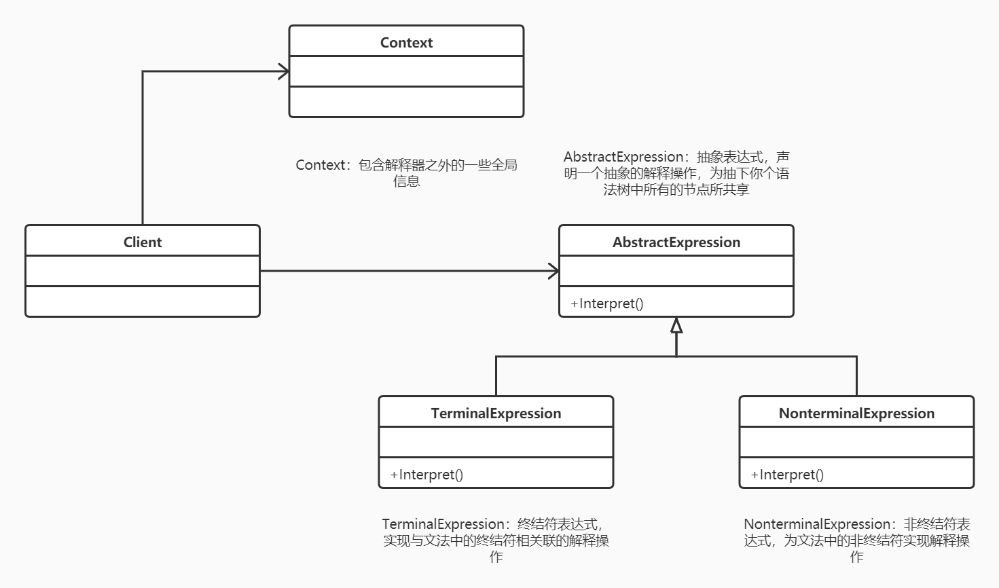

**代码**

```c++
class Context {
public:

private:
	string input;
	string output;
};

class AbstractExpression {
public:
	virtual void Interpret(Context context) = 0;
};

class TerminalExpression : public AbstractExpression {
public:
	virtual void Interpret(Context context) override {

	}
};

class NonterminalExpression : public AbstractExpression {
public:
	virtual void Interpret(Context context) override {

	}
};
```

#### 访问者模式

- 表示一个作用于某对象结构中的各元素的操作，可使不改变元素的类的前提下定义作用于这些元素的新操作
- 访问者模式适用于数据结构相对稳定的系统，它将数据结构和作用于结构上的操作之间的耦合解脱开，使得操作集合可以相对自由的演化
- 优点：增加新的操作很容易，只需要新增一个访问者，并将相关行为集中到一个访问者对象中
- 缺点：增加新的数据结构困难


**代码**

```c++
class Element {
public:
	virtual void Accept(Visitor* visitor) = 0;
};

class ConcreteElementA : public Element {
public:
	virtual void Accept(Visitor* visitor) {
		visitor->VisitConcreteElementA(this);
	}

	void OpreationA() {

	}
};

class ConcreteElementB : public Element {
public:
	virtual void Accept(Visitor* visitor) {
		visitor->VisitConcreteElementB(this);
	}

	void OpreationA() {

	}
};

class Visitor {
public:
	virtual void VisitConcreteElementA(ConcreteElementA* concreteElementA) = 0;
	virtual void VisitConcreteElementB(ConcreteElementB* concreteElementB) = 0;
};

class ConcreteVisitorA : public Visitor {
public:
	virtual void VisitConcreteElementA(ConcreteElementA* concreteElementA) override {

	}
	virtual void VisitConcreteElementB(ConcreteElementB* concreteElementB) override {

	}
};

class ConcreteVisitorA : public Visitor {
public:
	virtual void VisitConcreteElementA(ConcreteElementA* concreteElementA) override {

	}
	virtual void VisitConcreteElementB(ConcreteElementB* concreteElementB) override {

	}
};

class ObjectStructure {
public:
	void Attach(Element* element) {
		elements.push_back(element);
	}

	void Detach(Element* element) {
		elements.erase(element);
	}

	void Accept(Visitor* visitor) {
		for (Element* e : elements) {
			e->Accept(visitor);
		}
	}

private:
	vector<Element*> elements;
};
```
